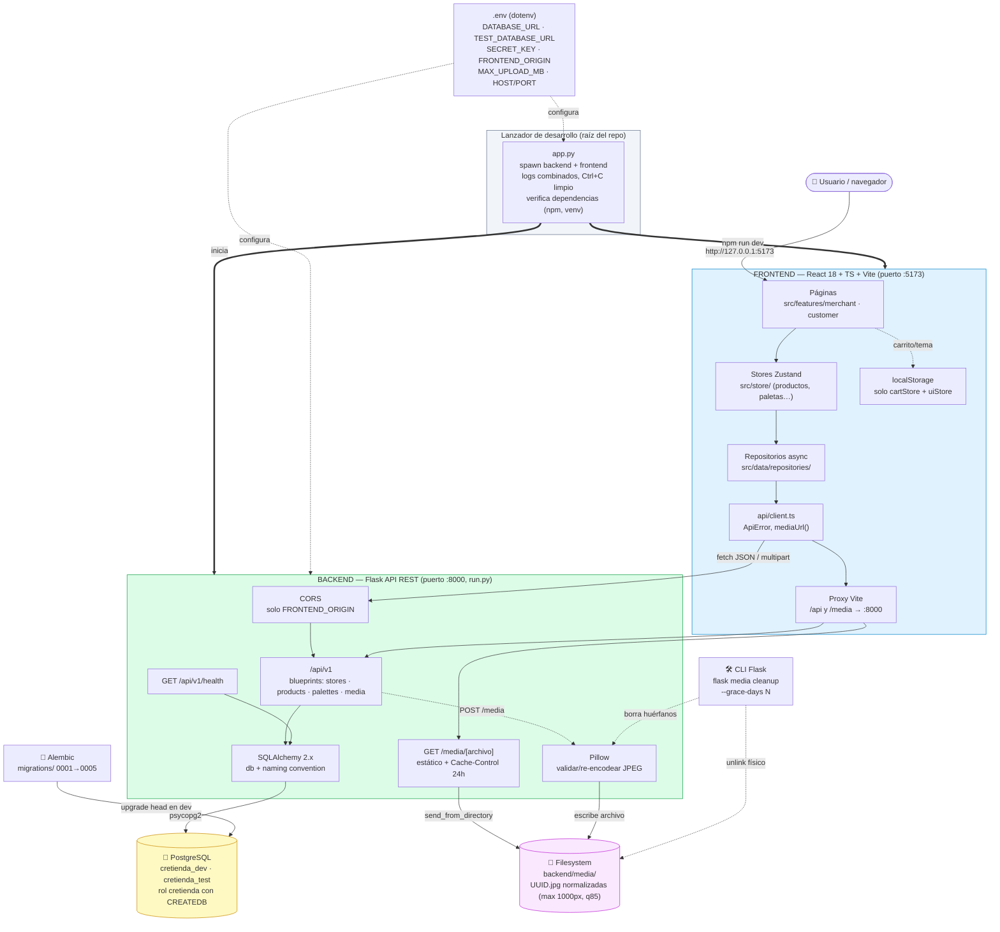
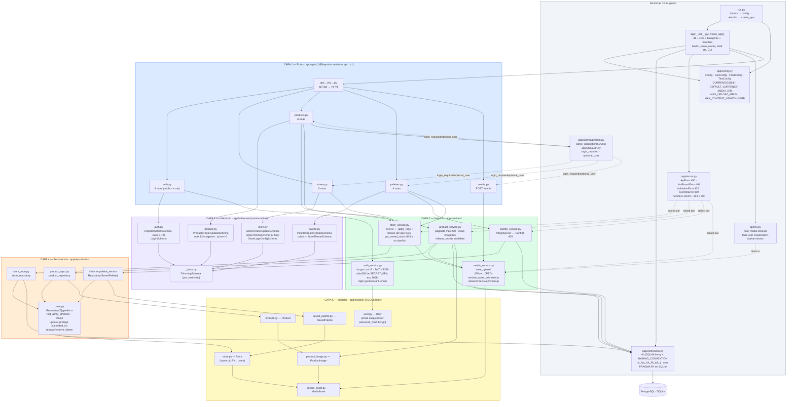
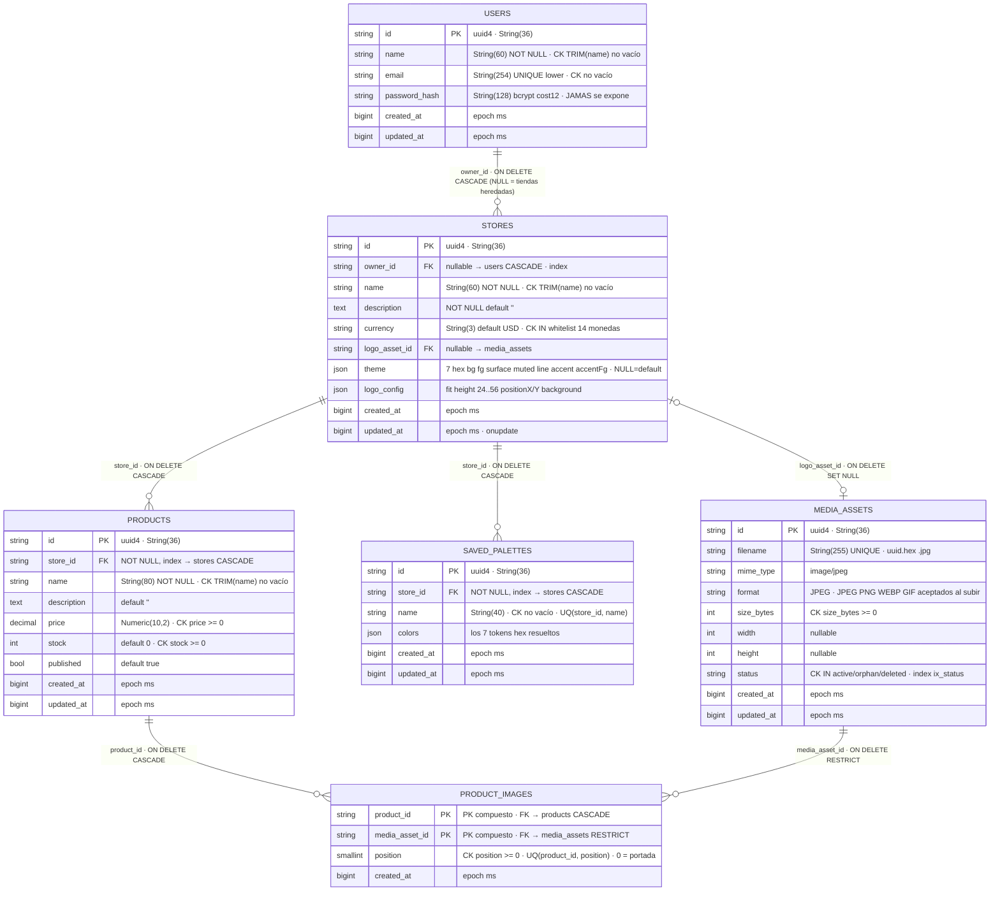
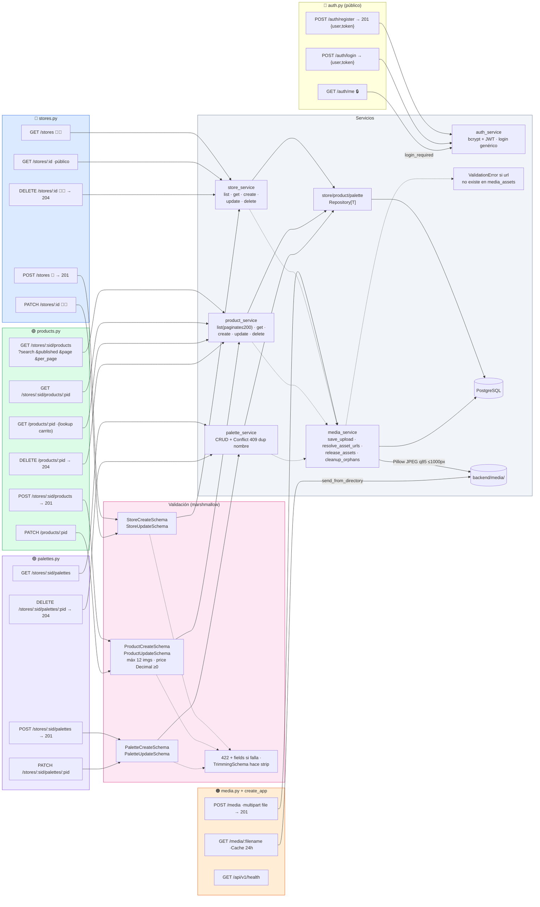
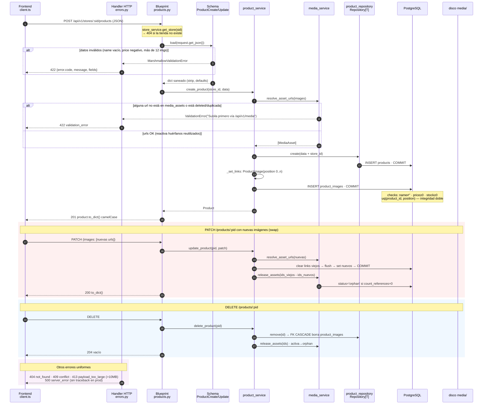
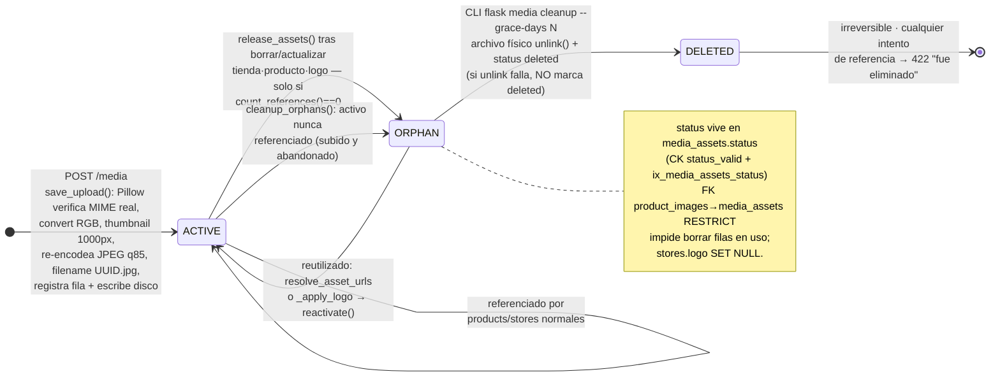
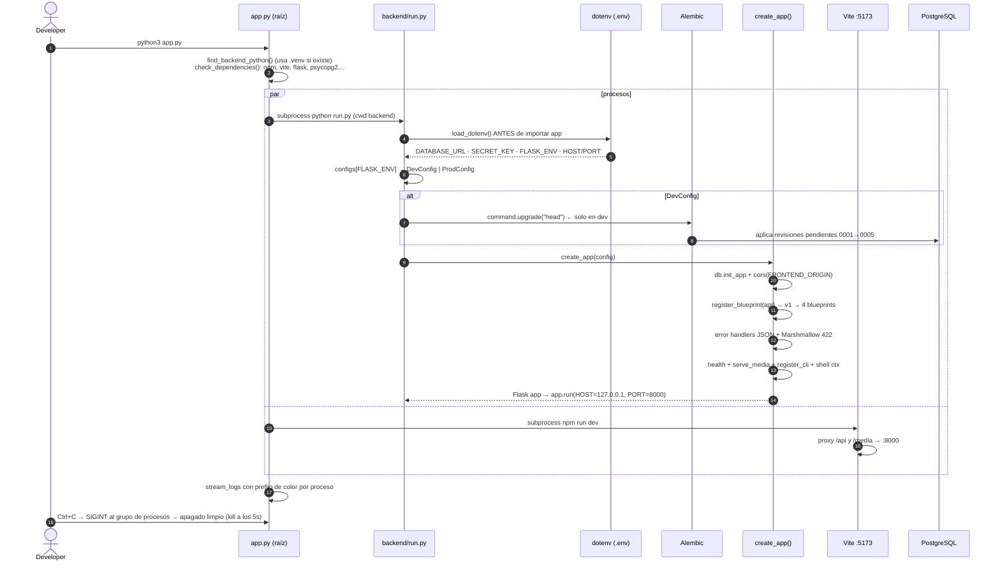
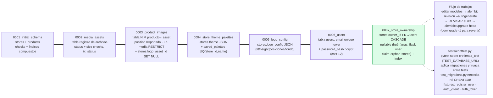

# CreaTienda — Diagramas del Backend

Documentación visual completa del backend (`backend/`): API REST en **Python/Flask** con
arquitectura en capas (**rutas → servicios → repositorios → modelos**), persistencia en
**PostgreSQL** vía SQLAlchemy, esquema versionado con **Alembic** y almacenamiento de
imágenes en el **filesystem local**.

> Fuente: análisis de todo el código en `backend/app/`, `backend/migrations/`, `run.py`
> y el lanzador raíz `app.py`. Fecha: 2026-10-02.

## Índice

| # | Diagrama | Tipo | Qué muestra |
|---|---|---|---|
| 1 | [Arquitectura general](#1-arquitectura-general) | `flowchart` | Sistema completo: frontend, backend, BD, media, procesos y puertos |
| 2 | [Capas y módulos](#2-capas-y-módulos) | `flowchart` | Cada archivo por capa y sus dependencias |
| 3 | [Modelo de datos](#3-modelo-de-datos) | `erDiagram` | 5 tablas, columnas, FKs con reglas de borrado, checks e índices |
| 4 | [Mapa de endpoints](#4-mapa-de-endpoints-apiv1) | `flowchart` | Las 21 rutas con su schema de validación y su servicio |
| 5 | [Flujo de una petición](#5-flujo-de-una-petición) | `sequenceDiagram` | Ciclo vida completo de POST/PATCH/DELETE de productos |
| 6 | [Ciclo de vida de MediaAsset](#6-ciclo-de-vida-de-mediaasset) | `stateDiagram` | active → orphan → deleted, reactivación y cleanup |
| 7 | [Arranque y migraciones](#7-arranque-y-migraciones) | `sequence` + `flowchart` | Cadena de arranque y las revisiones 0001→0005 |

---

## 1. Arquitectura general

Todo el sistema: el lanzador de desarrollo levanta backend y frontend; los datos de
dominio fluyen del frontend al backend (fuente única de verdad); el backend persiste en
PostgreSQL y guarda las imágenes normalizadas en disco.

---

## 2. Capas y módulos

Arquitectura estricta en capas dentro de `backend/app/`. Nada salta capas: las rutas solo
orquestan, los servicios contienen la lógica de negocio, los repositorios abstracten el
CRUD y los modelos definen el esquema.

---

## 3. Modelo de datos

Las 5 tablas con columnas, claves y reglas de integridad. Reglas de borrado críticas:
un producto nunca sobrevive a su tienda (CASCADE), una imagen en uso no puede borrarse
(RESTRICT) y quitar un logo deja el asset huérfano en vez de romper la FK (SET NULL).

**Índices adicionales declarados en modelos/migraciones:**

| Tabla | Índice | Uso |
|---|---|---|
| `products` | `ix_products_store_published_created (store_id, published, created_at)` | storefront: publicados por fecha |
| `products` | `ix_products_store_created (store_id, created_at)` | listing del panel merchant |
| `product_images` | `ix_product_images_media_asset (media_asset_id)` | `count_references` al liberar assets |
| `media_assets` | `ix_media_assets_status (status)` | cleanup de huérfanos |
| `saved_palettes` | index en `store_id` + `uq_saved_palettes_store_id_name` | unicidad por tienda |

> Naming convention global en `app/extensions.py`: `ix_ / uq_ / ck_ / fk_ / pk_` —
> garantiza diffs limpios de `alembic revision --autogenerate`.
> `to_dict()` de todos los modelos emite **camelCase** con timestamps en ms, espejando
> `src/shared/types/domain.ts` del frontend.

---

## 4. Mapa de endpoints `/api/v1`

Las 21 rutas efectivas (15 de negocio + 3 de auth + media estático + health + upload),
con el schema marshmallow que valida el body y la función de servicio que ejecuta.
`🔒` = requiere sesión · `👑` = requiere ser el dueño de la tienda · sin marca = público.

**Regla estricta de imágenes:** los campos `logo` (tiendas) y `images` (productos) deben
ser URLs previamente devueltas por `POST /media` y existentes en `media_assets`;
cualquier otra URL devuelve `422 validation_error`.

---

## 5. Flujo de una petición

Ciclo completo de una escritura de producto (el caso más rico): validación doble
(marshmallow + constraints de BD), resolución de media, transacción y respuesta
camelCase; incluye los caminos de error.

---

## 6. Ciclo de vida de MediaAsset

Ninguna operación de borrado toca archivos físicos en uso: los assets entran a `orphan`
y solo el CLI los elimina definitivamente tras el período de gracia.

---

## 7. Arranque y migraciones

### 7.1 Cadena de arranque (desarrollo)

### 7.2 Historia de migraciones (única forma de tocar el esquema — nunca `create_all()`)

---

## Notas transversales (visibles en los diagramas)

- **Doble validación:** marshmallow en la capa schemas + constraints/checks en la capa BD;
  ninguna de las dos se confía en la otra.
- **camelCase en la API:** `to_dict()` emite `storeId`, `createdAt` (ms), `logoConfig`,
  `accentFg`… espejo exacto de `src/shared/types/domain.ts`; cambiar un modelo exige
  cambiar el dominio TS.
- **Monedas:** whitelist de 14 en `app/config.py::CURRENCIES`, sincronizada con
  `src/config/constants.ts`.
- **Seguridad de media:** MIME real verificado con Pillow (no la extensión), re-encodeo a
  JPEG (strips metadata/ataques), nombres UUID, protección contra path traversal en
  `find_asset_by_url`, `MAX_CONTENT_LENGTH` limita el body a `MAX_UPLOAD_MB+5` MB (413).
- **Multi-tenancy simple:** todo cuelga de `stores.id`; los endpoints anidados validan que
  el recurso pertenezca a la tienda (404 si no, sin revelar existencia).
- **Auth (fase usuarios):** `users` con email único en minúsculas y `password_hash` bcrypt
  cost 12 (nunca se expone ni se loguea). Sesión = JWT HS256 (clave derivada de `SECRET_KEY`
  con SHA-256, exp 168 h) enviada como `Authorization: Bearer`. Login fallido → 401
  `credenciales_invalidas` genérico (anti-enumeración). Guardas: `@login_required` y
  `optional_user()` en `app/utils/auth.py`.
- **Visibilidad por rol:** cada tienda tiene `owner_id`; los visitantes anónimos del
  storefront solo ven tiendas y productos **publicados**; el dueño ve sus borradores; las
  mutaciones y las paletas requieren sesión + propiedad (ajeno = 404, no revela existencia).
